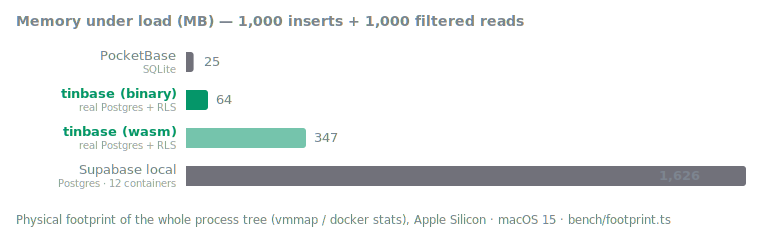

<p align="center"></p>

# tinbase

A pure-JS, Docker-free Supabase backend built on [PGlite](https://pglite.dev) (Postgres compiled to WASM). It speaks the same wire protocols as hosted Supabase, so the **official `@supabase/supabase-js` SDK works unchanged** - REST, Auth, Storage, and Realtime.

One command, one small binary, real Postgres with Row Level Security - and 1:1 with Supabase's APIs and migration conventions.

> [!WARNING]
> **Experimental.** tinbase is young and moving fast - great for prototypes, local development, demos, and embedded/browser use. It is **not meant for production usage** yet.

```
npx tinbase start
```

- **No Docker, no external services.** One runtime dependency: `@electric-sql/pglite`.
- **Real Postgres semantics.** RLS policies, `auth.uid()`, triggers, FKs - it is Postgres.
- **Two engines, one API.** Default is PGlite (WASM Postgres - portable, browser-ready). `--engine native` runs an embedded native Postgres instead: ~53 MB of RAM at boot, PocketBase-class footprint, zero semantic differences.
- **Supabase CLI migration conventions.** Reads `supabase/migrations/*.sql` and `supabase/seed.sql`; tracks them in `supabase_migrations.schema_migrations`. Your migration files stay portable to hosted Supabase.
- **Browser-ready core.** Every service is a pure `(Request) => Response` fetch handler. In Node it's served over HTTP; in the browser you can hand it to supabase-js as a custom `fetch` and run the whole backend in-process (PGlite already runs in the browser via IndexedDB/OPFS).

## Quick start

```bash
# in a project with a supabase/ directory (or none - it still boots)
npx tinbase start

#   API URL: http://127.0.0.1:54321
#   anon key: eyJ...
#   service_role key: eyJ...
```

Point the ordinary supabase-js client at it:

```ts
import { createClient } from '@supabase/supabase-js'

const supabase = createClient('http://127.0.0.1:54321', ANON_KEY)

await supabase.auth.signUp({ email: 'me@example.com', password: 'secret123' })
await supabase.from('todos').insert({ title: 'hello' })
const { data } = await supabase.from('todos').select('*, author:users(name)').eq('done', false)

supabase
  .channel('feed')
  .on('postgres_changes', { event: 'INSERT', schema: 'public', table: 'todos' }, console.log)
  .subscribe()
```

### CLI

```
tinbase start      # boot the server (applies pending migrations first)
tinbase migrate    # apply pending migrations and exit
tinbase status     # list applied migrations
tinbase keys       # print anon / service_role keys

  -p, --port <n>        port (default 54321; or TINBASE_PORT / PORT env)
      --dir <path>      project dir containing supabase/ (default cwd)
      --data-dir <path> PGlite data dir (default <dir>/.tinbase/db)
      --jwt-secret <s>  JWT secret (or TINBASE_JWT_SECRET)
      --memory          in-memory database, no persistence (wasm engine)
      --engine <e>      wasm (default) or native
```

### Engines

- **wasm** (default): PGlite. Zero setup, runs anywhere Node runs - and in the browser. Costs ~350 MB RAM.
- **native**: embedded native Postgres 17. First run downloads platform binaries (~12 MB, from [theseus-rs/postgresql-binaries](https://github.com/theseus-rs/postgresql-binaries), cached in `~/.cache/tinbase`), then `initdb` with memory-lean settings. ~53 MB RAM at boot. Listens only on a private unix socket (0700 dir, trust auth) - never TCP. macOS/Linux on x64/arm64; on Windows use wasm.

Both engines run the identical bootstrap, migrations, RLS, and realtime CDC - the test suite passes on both (`TINBASE_TEST_ENGINE=native npm test`).

### Single-binary build

```bash
npm run build:binary   # requires bun; emits dist-bin/tinbase (~57 MB)

./tinbase start        # that's the whole deployment
```

One compiled executable, no Node or npm on the target machine. It defaults to the native engine (Postgres binaries auto-download on first run, 12 MB) and serves everything - REST, Auth, Storage, Realtime WebSockets - at 44 MB of RAM at boot. Runs under Bun's runtime via a Bun-native server (`Bun.serve` + built-in WebSockets); the same CLI on Node uses the node:http server.

## Embedding (Node or browser)

```ts
import { createBackend } from 'tinbase'

const backend = await createBackend({
  // dataDir: 'idb://my-app'  <- browser persistence
  migrations: [{ name: '20240101000000_init', sql: 'create table notes (...)' }],
})

// supabase-js talks to it in-process - no HTTP server, no network
const supabase = createClient('http://localhost', backend.anonKey, {
  global: { fetch: (input, init) => backend.fetch(new Request(input, init)) },
})
```

Node-only helpers live in `tinbase/node`:

```ts
import { serve, FsStorageDriver, loadSupabaseProject } from 'tinbase/node'

const project = await loadSupabaseProject(process.cwd())
const backend = await createBackend({ ...project, storageDriver: new FsStorageDriver('./files') })
const server = await serve(backend, { port: 54321 })
```

## What's implemented

| Service | Endpoint | Coverage |
| --- | --- | --- |
| REST (PostgREST) | `/rest/v1` | select with embedded resources (to-one, to-many, many-to-many via junction, nested, `!inner`, aliases, hints, casts, JSON paths), all common filter operators incl. `or`/`and` trees, full-text search, order/limit/offset (top-level and per-embed), `single`/`maybeSingle`, `count`, insert/bulk insert, upsert (merge/ignore), update, delete, `Prefer` handling, RPC (scalar, `setof`, void, filters on results), PostgREST-shaped errors |
| Auth (GoTrue) | `/auth/v1` | email/password signup + sign-in, anonymous sign-in, session refresh with rotation, `getUser`, `updateUser`, sign-out, admin user CRUD (service key), GoTrue-shaped errors. JWTs are HS256 via WebCrypto; passwords are PBKDF2 |
| Storage | `/storage/v1` | bucket CRUD, upload (raw + multipart), download, public objects, signed URLs, signed upload URLs, list with folder entries, move/copy, remove, size/MIME limits. Metadata lives in `storage.objects` with RLS enforced; bytes go through a pluggable driver (fs in Node, memory anywhere) |
| Edge Functions | `/functions/v1` | `supabase.functions.invoke()` - functions are plain fetch handlers, loaded from `supabase/functions/<name>/index.{js,mjs,ts}` (default export) by the CLI or passed programmatically via `createBackend({ functions })`; each call receives the verified auth context and env keys |
| Studio (Admin UI) | `/_/` | A Supabase-Studio-style dashboard (React + Radix + Tailwind): Table Editor with full row CRUD, SQL editor, user management, bucket/object CRUD, and a database overview. One self-contained HTML file (works in the single binary); log in with the service_role key |
| Realtime | `/realtime/v1` | Phoenix protocol (v1 JSON and v2 array/binary serializers), `postgres_changes` (INSERT/UPDATE/DELETE, filters) fed by triggers + `pg_notify`, broadcast (incl. binary payloads), presence. WebSocket server is a ~150-line RFC 6455 implementation - no `ws` dependency |

### RLS works like real Supabase

Every REST/storage request runs inside a transaction with `SET LOCAL role` and `request.jwt.claims`, so policies like this behave identically to hosted Supabase:

```sql
create policy "own rows" on todos
  for all to authenticated
  using (user_id = auth.uid()) with check (user_id = auth.uid());
```

## Studio

tinbase ships with a built-in dashboard at [`/_/`](http://127.0.0.1:54321/_/) - the same shape as Supabase Studio:

- **Table Editor** - browse tables with pagination and row counts; insert, edit, and delete rows (type-aware, primary-key based)
- **SQL Editor** - run arbitrary SQL with result grids and Postgres error details
- **Authentication** - list, create, delete users and reset passwords
- **Storage** - create/delete buckets, upload/delete objects, toggle public access
- **Database** - stats overview and applied migrations

It is a React app compiled to a single self-contained HTML file, so it also works inside the single binary. Sign in with the `service_role` key printed at startup.

## Footprint: tinbase vs PocketBase vs Supabase local



Measured on an Apple Silicon Mac (48 GB), macOS 15. Same workload for all three: boot with one migrated table, then 1,000 single-row inserts followed by 1,000 filtered list queries. Memory is physical footprint (`vmmap`) for native processes and the sum of `docker stats` for containers. Reproduce with [`bench/footprint.ts`](bench/footprint.ts); raw numbers in [`bench/results.json`](bench/results.json).

| | tinbase (single binary) | tinbase (native, Node) | tinbase (wasm) | PocketBase v0.39.5 | Supabase local (CLI 2.40) |
| --- | --- | --- | --- | --- | --- |
| Database | real Postgres 17 + RLS | real Postgres 17 + RLS | real Postgres (PGlite) + RLS | SQLite | Postgres 17 |
| Runtime memory at boot | 44 MB | 53 MB | 573 MB | 16 MB | 1,441 MB |
| Runtime memory after workload | 64 MB | 96 MB | 347 MB¹ | 25 MB | 1,626 MB |
| Data on disk (1k rows) | 38 MB | 38 MB | 39 MB | 7 MB | 70 MB |
| Install size | 92 MB (no runtime needed) | 35 MB² | 26 MB² | 30 MB | 2,291 MB³ |
| Processes | 2 (tinbase + postgres) | 2 (node + postgres) | 1 | 1 | 12 containers + Docker |
| 1,000 inserts | 0.4 s | 0.5 s | 0.8 s | 0.3 s | 1.1 s |
| 1,000 filtered reads | 0.4 s | 0.4 s | 0.8 s | 0.3 s | 1.0 s |

¹ PGlite's WASM instantiation peaks at boot, then the OS reclaims pages; steady state under load is ~350 MB.
² Native: unpacked Postgres 17 binaries + `dist`. Wasm: `dist` + `@electric-sql/pglite`. Both exclude the Node runtime you already have.
³ Sum of the Docker image sizes the default local stack runs, excluding Docker Desktop itself.

**How to read this honestly:**

- **vs Supabase local**: same SDK, same APIs, ~15-27x less memory (native engine), ~65x smaller install, 2 processes instead of a 12-container stack, and boots in ~2 s instead of a minute. That's the entire point of the project.
- **vs PocketBase**: the single binary lands in PocketBase's weight class - ~2.5x the RAM, one downloadable file, no runtime prerequisite - while running *real Postgres* (RLS, jsonb, FKs, triggers) behind Supabase's exact wire APIs, so your code and migration files move to hosted Supabase unchanged. PocketBase is still the lightest option if you don't need any of that.
- The wasm engine's memory is almost entirely the PGlite WASM heap; the API layers add single-digit MB. Use it where portability matters (browser, one-dependency installs); use `--engine native` on servers.

## How complete is it?

Rough coverage of the supabase-js SDK surface, measured against what each sub-library can express (all "supported" claims are exercised by the test suite):

| Module | Coverage | Supported | Missing |
| --- | --- | --- | --- |
| Database (`postgrest-js`) | ~85% | full filter grammar, embeds (to-one/to-many/m2m/nested/`!inner`), JSON paths, upsert, count, single/maybeSingle, RPC | aggregates in select, full spread embeds, `.explain()`, `.csv()`, geojson |
| Auth (`auth-js`) | ~65% | email/password, anonymous sign-in, OTP + magic links + password recovery (pluggable mailer, console default), refresh rotation, user updates, admin CRUD | OAuth providers, MFA, SSO/SAML, PKCE, phone auth |
| Storage (`storage-js`) | ~80% | buckets, upload/download, signed URLs + signed uploads, list/move/copy/remove, size/MIME limits | resumable (TUS) uploads, image transformations |
| Realtime (`realtime-js`) | ~70% | postgres_changes with filters, broadcast (incl. binary), presence, v1+v2 serializers | RLS-filtered fan-out (WALRUS), private channel auth, DB-triggered broadcast |
| Edge Functions (`functions-js`) | ~60% | `invoke()` with JSON/text bodies, auth context, project-dir loading | Deno runtime compat, import maps, `supabase functions deploy` |

**Overall: roughly 75% of the SDK surface - but ~90% of what a typical CRUD + auth + storage + realtime app actually calls.** The biggest real-world gaps are OAuth logins and edge functions.

## Known gaps

- `postgres_changes` does not apply RLS to fan-out (all subscribers see change events); hosted Supabase filters via WALRUS.
- Spread embeds (`...rel(col)`) support flat column lists only; aggregate functions in `select` are not implemented.
- Auth: no OAuth providers, MFA, or SSO. OTP/magic-link/recovery emails go through a pluggable `mailer` (the default just logs them to the console).
- `pg_notify` payloads cap at ~8 kB - realtime events for larger rows arrive with `record: null` and an `errors` entry, like Supabase's "payload too large".
- One writer at a time: PGlite is single-connection, and the native engine currently serializes requests over one connection for parity (a connection pool is a straightforward future upgrade). Fine for dev tools and small apps, not for high-concurrency production.

## Tests

53 integration tests + 4 realtime e2e tests run the real `@supabase/supabase-js` against the backend (REST via in-process fetch, realtime over actual WebSockets):

```bash
npm test
```

## Why

tinbase was built for [lifo](https://lifo.sh) - a project that maps Linux APIs into the browser - to let **Expo apps run fully in the browser with full-stack capability** (database, auth, storage, realtime, no server). It is part of [RapidNative](https://rapidnative.com). That origin drives the architecture:

1. Every service is a pure fetch handler and the default engine is Postgres compiled to WASM, so the whole backend can run **in-process inside a browser tab**.
2. The same design makes a lighter Supabase for local dev and self-contained apps - `npx tinbase start` instead of Docker Compose.
